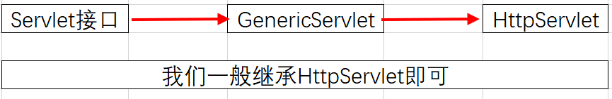

### 定义

* Servlet是sun公司开发动态Web的技术。
* Sun公司提供了Servlet接口，其实只要实现Servlet接口，再发布到Web服务器中。

### 创建1个Servlet程序

#### 0.Sun公司编写了GenericServlet作为Servlet实现类，



#### 1.建立一个空的Maven项目，把src删掉，就剩这三个文件。

* 这三个文件就是Maven项目的主工程。


* 导入Servlet常用的包

```java

    <dependencies>
        <!-- https://mvnrepository.com/artifact/javax.servlet/javax.servlet-api -->
        <dependency>
            <groupId>javax.servlet</groupId>
            <artifactId>javax.servlet-api</artifactId>
            <version>4.0.1</version>
            <scope>provided</scope>
        </dependency>
        <!-- https://mvnrepository.com/artifact/javax.servlet.jsp/javax.servlet.jsp-api -->
        <dependency>
            <groupId>javax.servlet.jsp</groupId>
            <artifactId>javax.servlet.jsp-api</artifactId>
            <version>2.3.3</version>
            <scope>provided</scope>
        </dependency>
        <!-- https://mvnrepository.com/artifact/javax.servlet.jsp/jsp-api -->
        <dependency>
            <groupId>javax.servlet.jsp</groupId>
            <artifactId>jsp-api</artifactId>
            <version>2.1</version>
            <scope>provided</scope>
        </dependency>

    </dependencies>

```

#### 2.创建子工程

* New Module


* 选择WebApp，改个名字到底。


* 就建立了子工程


* 在maven窗口可以看到多了子工程


#### 3. 父子工程性质

* 父项目pom文件中会多了子项目名字的module


* 子项目的pom文件会有父项目的parent
  * 而且子项目可以直接使用父项目导入的jar包


#### 4.把子项目的web.xml文件换成新的


```java

<?xml version="1.0" encoding="UTF-8"?>
<web-app xmlns="http://xmlns.jcp.org/xml/ns/javaee"
         xmlns:xsi="http://www.w3.org/2001/XMLSchema-instance"
         xsi:schemaLocation="http://xmlns.jcp.org/xml/ns/javaee
          http://xmlns.jcp.org/xml/ns/javaee/web-app_4_0.xsd"
         version="4.0">
</web-app>
```

#### 5.建立结构


#### 6.编写一个Servlet程序

```java
package com.rzp.servlet;

import javax.servlet.ServletException;
import javax.servlet.http.HttpServlet;
import javax.servlet.http.HttpServletRequest;
import javax.servlet.http.HttpServletResponse;
import java.io.IOException;
import java.io.PrintWriter;

//继承HttpServlet 
public class HelloServlet extends HttpServlet {
    //由于get post只是请求实现的不同方式，可以相互调用，因为业务逻辑都一样

    @Override
    protected void doGet(HttpServletRequest req, HttpServletResponse resp) throws ServletException, IOException {
        PrintWriter writer = resp.getWriter();//响应流
        writer.print("Hello,Serlvet");
    }

    @Override
    protected void doPost(HttpServletRequest req, HttpServletResponse resp) throws ServletException, IOException {
        doGet(req, resp);
    }
}

```

#### 7.编写Servlet的映射：

* 为什么需要映射：我们写的Java程序，要通过浏览器连接web服务器访问，所以需要在web服务中注册我们写的Servlet，还需要给他一个浏览器能访问的路径。


```java
    <!--注册Servlet-->
    <servlet>
        <servlet-name>hello</servlet-name>
        <servlet-class>com.rzp.servlet.HelloServlet</servlet-class>
    </servlet>

    <!--Servlet的请求路径-->
    <servlet-mapping>
        <servlet-name>hello</servlet-name>
        <url-pattern>/hello</url-pattern>
    </servlet-mapping>
</web-app>


```

* 请求流程
  * 在浏览器输入地址
  * 
  * 服务器会去web.xml文件中找servlet-mapping配置的请求路径
  * 找到后根据name找到对应的class文件，然后执行class
  * 
  * 

#### 8.配置Tomcat


#### 9.启动程序

### Servlet原理


### 如何从网址指向网页

1. 一个Servlet可以指定一个映射路径

   ```xml
       <servlet-mapping>
           <servlet-name>hello</servlet-name>
           <url-pattern>/hello</url-pattern>
       </servlet-mapping>
   ```

2. 一个Servlet可以指定多个映射路径

   ```xml
       <servlet-mapping>
           <servlet-name>hello</servlet-name>
           <url-pattern>/hello</url-pattern>
       </servlet-mapping>
       <servlet-mapping>
           <servlet-name>hello</servlet-name>
           <url-pattern>/hello2</url-pattern>
       </servlet-mapping>
       <servlet-mapping>
           <servlet-name>hello</servlet-name>
           <url-pattern>/hello3</url-pattern>
       </servlet-mapping>
   ```

3. 一个Servlet可以指定通用映射路径

   ```xml
       <servlet-mapping>
           <servlet-name>hello</servlet-name>
           <url-pattern>/hello/*</url-pattern>
       </servlet-mapping>
   ```

4. 默认请求路径

   * 级别最高，所有的都走到这个路径了

   ```xml
       <!--默认请求路径-->
       <servlet-mapping>
           <servlet-name>hello</servlet-name>
           <url-pattern>/*</url-pattern>
       </servlet-mapping>
   ```

5. 指定一些后缀或者前缀等等….

   ```xml
   <!--可以自定义后缀实现请求映射
       注意点，*前面不能加项目映射的路径,不能加/
       hello/sajdlkajda.qinjiang
       -->
   <servlet-mapping>
       <servlet-name>hello</servlet-name>
       <url-pattern>*.qinjiang</url-pattern>
   </servlet-mapping>
   ```

6. 优先级问题
   指定了固有的映射路径优先级最高，如果找不到就会走默认的处理请求；

   ```xml
   <!--404-->
   <servlet>
       <servlet-name>error</servlet-name>
       <servlet-class>com.kuang.servlet.ErrorServlet</servlet-class>
   </servlet>
   <servlet-mapping>
       <servlet-name>error</servlet-name>
       <url-pattern>/*</url-pattern>
   </servlet-mapping>
   
   ```

### ServletContext

#### 1.共享数据

* web容器在启动的时候，会为每个web容器程序创建一个对应的ServletContext对象，代表了当前web应用。

  * 在一个Servlet里面的内容，在另一个Servlet里可以使用。

    

* 创建hello类，存放对象到ServletContext中

  ```java
  public class HelloServlet extends HttpServlet {
      @Override
      protected void doGet(HttpServletRequest req, HttpServletResponse resp) throws ServletException, IOException {
  //        this.getInitParameter()  初始化参数，也可以在web的Servlet里面配置
  //        this.getServletConfig()  Servlet配置
  //        this.getServletContext() 上下文
  //        this.getInitParameterNames()
          ServletContext ct = this.getServletContext();
          String username = "rzp";
          ct.setAttribute("username",username);  //把一个对象保存在了ServletContext中
  
  
          System.out.println("Hello");
      }
  }
  
  ```

  

* 创建GetServletTest类，从ServletContext取对象

  ```java
  public class GetServletTest extends HttpServlet {
      @Override
      protected void doGet(HttpServletRequest req, HttpServletResponse resp) throws ServletException, IOException {
          ServletContext ct = this.getServletContext();
          String username = (String) ct.getAttribute("username");
  
          //解决乱码
          resp.setContentType("text/html");
          resp.setCharacterEncoding("utf-8");
          //打印名字
          resp.getWriter().print("名字=="+username);
      }
  
      @Override
      protected void doPost(HttpServletRequest req, HttpServletResponse resp) throws ServletException, IOException {
          doGet(req,resp);
      }
  }
  
  ```

  

* 配置相应的web.xml

  ```java
  <?xml version="1.0" encoding="UTF-8"?>
  <web-app xmlns="http://xmlns.jcp.org/xml/ns/javaee"
           xmlns:xsi="http://www.w3.org/2001/XMLSchema-instance"
           xsi:schemaLocation="http://xmlns.jcp.org/xml/ns/javaee
                      http://xmlns.jcp.org/xml/ns/javaee/web-app_4_0.xsd"
           version="4.0"
           metadata-complete="true">
      
      <servlet>
          <servlet-name>hello</servlet-name>
          <servlet-class>com.rzp.servlet01.HelloServlet</servlet-class>
  
      </servlet>
      <servlet-mapping>
          <servlet-name>hello</servlet-name>
          <url-pattern>/hello</url-pattern>
      </servlet-mapping>
      
      
      <servlet>
          <servlet-name>gets</servlet-name>
          <servlet-class>com.rzp.servlet01.GetServletTest</servlet-class>
      </servlet>
      <servlet-mapping>
          <servlet-name>gets</servlet-name>
          <url-pattern>/gets</url-pattern>
      </servlet-mapping>
  </web-app>
  ```

  

* 测试

  先在网址输入http://localhost:8080/servlet_01_war/hello，存放数据。

  再输入http://localhost:8080/servlet_01_war/gets，就能正确显示

  

* 扩展:解决乱码的方法，学会看网页的源码


#### 2.获取初始化的参数

​	web.xml中配置参数

```java

    <!--配置一些web应用初始化参数-->
    <context-param>
        <param-name>url</param-name>
        <param-value>jdbc:mysql://localhost:3308/mybatis</param-value>
    </context-param>
        
        
    <servlet>
        <servlet-name>gp</servlet-name>
        <servlet-class>com.rzp.servlet01.ServletDemo1</servlet-class>
    </servlet>
    <servlet-mapping>
        <servlet-name>gp</servlet-name>
        <url-pattern>/gp</url-pattern>
    </servlet-mapping>

```

​	获取参数

```java
public class ServletDemo1 extends HelloServlet{
    @Override
    protected void doGet(HttpServletRequest req, HttpServletResponse resp) throws ServletException, IOException {
        ServletContext ct = this.getServletContext();

        String url = ct.getInitParameter("url");
        resp.getWriter().print(url);
    }

    @Override
    protected void doPost(HttpServletRequest req, HttpServletResponse resp) throws ServletException, IOException {
        doGet(req,resp);
    }

}

```

测试


#### 3.请求转发 request dispatcher（更新方案：Request实现）

通过getRequestDispatcher把请求转向/gp

```java
public class ServletDemo2 extends HelloServlet {
    @Override
    protected void doGet(HttpServletRequest req, HttpServletResponse resp) throws ServletException, IOException {
        ServletContext ct = this.getServletContext();

        //转发的请求路径
//        RequestDispatcher rd = ct.getRequestDispatcher("/gp");
        //调用forward方法实现请求转发
//        rd.forward(req,resp);
        //一起写
        System.out.println("进入sd2方法");
        ct.getRequestDispatcher("/gp").forward(req,resp);
    }

    @Override
    protected void doPost(HttpServletRequest req, HttpServletResponse resp) throws ServletException, IOException {
        doGet(req,resp);
    }
}

```

配置web.xml

```java

    <servlet>
        <servlet-name>sd2</servlet-name>
        <servlet-class>com.rzp.servlet01.ServletDemo2</servlet-class>
    </servlet>
    <servlet-mapping>
        <servlet-name>sd2</servlet-name>
        <url-pattern>/sd2</url-pattern>
    </servlet-mapping>

```

测试:

​	虽然请求的是sd2，但是实际界面是gp的界面


核心：**转发**不会改变网址

* A一直之和B交互，和C没有接触


如果是**重定向**，那么A经过B，B告诉A要去C，网址会发生变化


#### 4.读取资源文件(更新方案：反射)

* 读取配置文件时，一般都是用输入流来获取，但是在web项目中，原来的绝对路径就不能用了（因为发布后的项目在不同服务器中，就没有绝对路径了）
* 因此要利用maven项目会把resources里的文件发布的到classpath下的特性
* classpath:项目发布后的classes路径

```java
public class ServletDemo5 extends HelloServlet {
    @Override
    protected void doGet(HttpServletRequest req, HttpServletResponse resp) throws ServletException, IOException {
        InputStream is = this.getServletContext().getResourceAsStream("/WEB-INF/classes/db.properties");
        Properties properties = new Properties();
        properties.load(is);
        String username = properties.getProperty("username");
        String password = properties.getProperty("password");
        resp.getWriter().print(username+"       "+password);

    }

    @Override
    protected void doPost(HttpServletRequest req, HttpServletResponse resp) throws ServletException, IOException {
        doGet(req,resp);
    }

}
```

如图，发布后的路径在"/WEB-INF/classes/db.properties"

