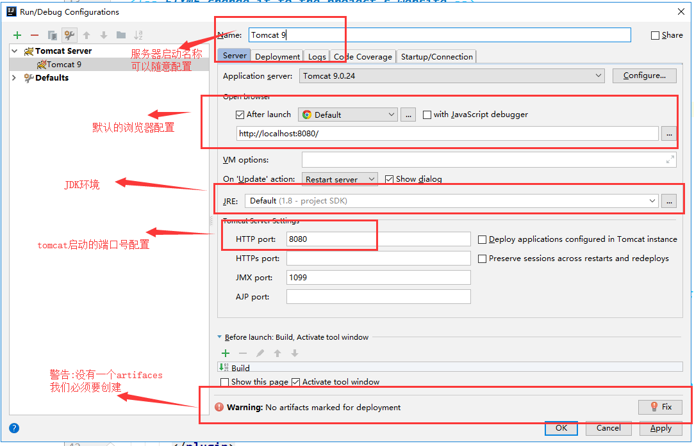

### 基本安装

#### 下载安装Maven

官网;https://maven.apache.org/

#### 配置环境变量

在我们的系统环境变量中

配置如下配置：

- M2_HOME     maven目录下的bin目录
- MAVEN_HOME      maven的目录
- 在系统的path中配置  %MAVEN_HOME%\bin


测试Maven是否安装成功，保证必须配置完毕！

####  阿里云镜像


- 镜像：mirrors
  - 作用：加速我们的下载
- 国内建议使用阿里云的镜像

```xml
<mirror>
    <id>nexus-aliyun</id>  
    <mirrorOf>*,!jeecg,!jeecg-snapshots</mirrorOf>  
    <name>Nexus aliyun</name>  
    <url>http://maven.aliyun.com/nexus/content/groups/public</url> 
</mirror>
```

####  本地仓库

在本地的仓库，远程仓库；

**建立一个本地仓库：**localRepository

```xml
<localRepository>D:\Environment\apache-maven-3.6.2\maven-repo</localRepository>
```

#### 在IDEA中使用Maven

1. 启动IDEA

2. 创建一个MavenWeb项目

   

   

   

   

   

在setting for new project中也如此配置，下次就不用反复配


#### 创建一个普通的Maven项目


这个只有在Web应用下才会有！


#### 标记文件夹功能


### 配置Tomcat




必须要的配置：**我们访问一个网站，需要指定一个文件夹名字；**


### 操作

1. clean 清除发布的文件 zhan'zhuan'fan'cezhanzhuanfance


2. validate 验证
3. compile 编译
4. test 测试
5. package 打包
6. install 安装

### 手动添加jar包文件夹


### pom文件

pom.xml 是Maven的核心配置文件


```xml
<?xml version="1.0" encoding="UTF-8"?>

<!--Maven版本和头文件-->
<project xmlns="http://maven.apache.org/POM/4.0.0" xmlns:xsi="http://www.w3.org/2001/XMLSchema-instance"
  xsi:schemaLocation="http://maven.apache.org/POM/4.0.0 http://maven.apache.org/xsd/maven-4.0.0.xsd">
  <modelVersion>4.0.0</modelVersion>

  <!--这里就是我们刚才配置的GAV-->
  <groupId>com.kuang</groupId>
  <artifactId>javaweb-01-maven</artifactId>
  <version>1.0-SNAPSHOT</version>
  <!--Package：项目的打包方式
  jar：java应用
  war：JavaWeb应用
  -->
  <packaging>war</packaging>


  <!--配置-->
  <properties>
    <!--项目的默认构建编码-->
    <project.build.sourceEncoding>UTF-8</project.build.sourceEncoding>
    <!--编码版本-->
    <maven.compiler.source>1.8</maven.compiler.source>
    <maven.compiler.target>1.8</maven.compiler.target>
  </properties>

  <!--项目依赖-->
  <dependencies>
    <!--具体依赖的jar包配置文件-->
    <dependency>
      <groupId>junit</groupId>
      <artifactId>junit</artifactId>
      <version>4.11</version>
    </dependency>
  </dependencies>

  <!--项目构建用的东西-->
  <build>
    <finalName>javaweb-01-maven</finalName>
    <pluginManagement><!-- lock down plugins versions to avoid using Maven defaults (may be moved to parent pom) -->
      <plugins>
        <plugin>
          <artifactId>maven-clean-plugin</artifactId>
          <version>3.1.0</version>
        </plugin>
        <!-- see http://maven.apache.org/ref/current/maven-core/default-bindings.html#Plugin_bindings_for_war_packaging -->
        <plugin>
          <artifactId>maven-resources-plugin</artifactId>
          <version>3.0.2</version>
        </plugin>
        <plugin>
          <artifactId>maven-compiler-plugin</artifactId>
          <version>3.8.0</version>
        </plugin>
        <plugin>
          <artifactId>maven-surefire-plugin</artifactId>
          <version>2.22.1</version>
        </plugin>
        <plugin>
          <artifactId>maven-war-plugin</artifactId>
          <version>3.2.2</version>
        </plugin>
        <plugin>
          <artifactId>maven-install-plugin</artifactId>
          <version>2.5.2</version>
        </plugin>
        <plugin>
          <artifactId>maven-deploy-plugin</artifactId>
          <version>2.8.2</version>
        </plugin>
      </plugins>
    </pluginManagement>
  </build>
</project>

```


##### build配置

maven由于他的约定大于配置，我们之后可以能遇到我们写的配置文件，无法被导出或者生效的问题

比如：resources中的properties是会自动打包的，但是JAVA文件夹里的properties就不会自动打包


解决方案：

```xml
<!--在build中配置resources，来防止我们资源导出失败的问题-->
<build>
    <resources>
        <resource>
            <!--resources其实可以不配，因为会自动打包-->
            <directory>src/main/resources</directory>
            <includes>
                <include>**/*.properties</include>
                <include>**/*.xml</include>
            </includes>
            <filtering>true</filtering>
        </resource>
        <resource>
             <!--java下配置了properties文件就能自动打包-->
            <directory>src/main/java</directory>
            <includes>
                <include>**/*.properties</include>
                <include>**/*.xml</include>
            </includes>
            <filtering>true</filtering>
        </resource>
    </resources>
</build>
```

