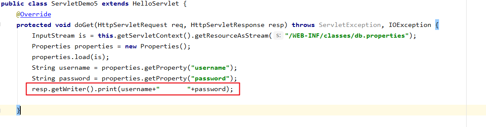
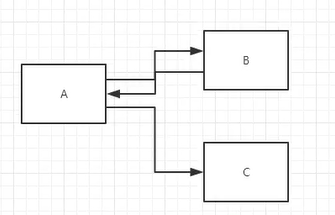
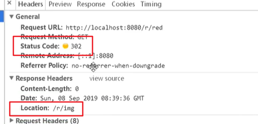

## Request&Response定义：

* web 服务器接收到客户端的http请求，针对这个请求，分别创建
  * 代表请求的HttpServletRequest对象，用于获取客户端请求过来的参数。
  * 代表响应的HttpServletResponse对象，用于给客户端响应。

## HttpServletResponse

**0.代表响应，以下方法包含父类ServletResponse的方法** 

### 1.负责向浏览器发送数据的方法

```java
    ServletOutputStream getOutputStream() throws IOException;
    PrintWriter getWriter() throws IOException;
```

### 2.负责向浏览器发出一些响应头

```java
    void setCharacterEncoding(String var1);
    void setContentLength(int var1);
    void setContentLengthLong(long var1);
    void setContentType(String var1);
    void setDateHeader(String var1, long var2);
    void addDateHeader(String var1, long var2);
    void setHeader(String var1, String var2);
    void addHeader(String var1, String var2);
    void setIntHeader(String var1, int var2);
    void addIntHeader(String var1, int var2);
```

### 3.响应状态码

```java
    int SC_NOT_FOUND = 404;
    int SC_BAD_GATEWAY = 502;
```

### 4.常见应用（重点）

#### 1、向浏览器输出消息（见02.Servlet）



#### 2、下载文件

1. 获取下载文件路径
2. 确认下载文件名
3. 让浏览器支持下载
4. 获取下载文件的输入流
5. 创建缓冲区
6. 获取OutputsStream对象
7. 将FileOutputStream流写入到buffer缓冲区
8. 使用OutputStream将缓冲区的数据输出到客户端

```java
package com.rzp.test1;

import javax.servlet.ServletException;
import javax.servlet.ServletOutputStream;
import javax.servlet.http.HttpServlet;
import javax.servlet.http.HttpServletRequest;
import javax.servlet.http.HttpServletResponse;
import java.io.FileInputStream;
import java.io.IOException;
import java.net.URLEncoder;

public class FileServlet extends HttpServlet {
    @Override
    protected void doGet(HttpServletRequest req, HttpServletResponse resp) throws ServletException, IOException {
        //1. 获取下载文件路径
        String realPath = this.getServletContext().getRealPath("/WEB-INF/classes/1.png");
        System.out.println("下载的文件路径"+realPath);
        //2. 确认下载文件名
        String filename = realPath.substring(realPath.lastIndexOf("\\") + 1);
        //3. 让浏览器支持下载,用URLEncoder.encode(filename,"UTF-8")编码，否则有可能乱码
        resp.setHeader("Content-Disposition", "attachment;filename="+ URLEncoder.encode(filename,"UTF-8"));
        //4. 获取下载文件的输入流
        FileInputStream in = new FileInputStream(realPath);
        //5. 创建缓冲区
        int len = 0;
        byte[] buffer = new byte[1024];
        //6. 获取OutputsStream对象
        ServletOutputStream out = resp.getOutputStream();
        //7. 将FileOutputStream流写入到buffer缓冲区,使用OutputStream将缓冲区的数据输出到客户端!
        while ((len = in.read(buffer))>0){
            out.write(buffer,0,len);
        }
        in.close();
        out.close();
    }

    @Override
    protected void doPost(HttpServletRequest req, HttpServletResponse resp) throws ServletException, IOException {
        doGet(req, resp);
    }
}

```

#### 3、验证码功能

* 前端实现
* 后端实现，生成图片

```java
package com.kuang.servlet;

import javax.imageio.ImageIO;
import javax.servlet.ServletException;
import javax.servlet.http.HttpServlet;
import javax.servlet.http.HttpServletRequest;
import javax.servlet.http.HttpServletResponse;
import java.awt.*;
import java.awt.image.BufferedImage;
import java.io.IOException;
import java.util.Random;

public class ImageServlet extends HttpServlet {

    @Override
    protected void doGet(HttpServletRequest req, HttpServletResponse resp) throws ServletException, IOException {

        //如何让浏览器3秒自动刷新一次;
        resp.setHeader("refresh","3");
        
        //在内存中创建一个图片
        BufferedImage image = new BufferedImage(80,20,BufferedImage.TYPE_INT_RGB);
        //得到图片
        Graphics2D g = (Graphics2D) image.getGraphics(); //笔
        //设置图片的背景颜色
        g.setColor(Color.white);
        g.fillRect(0,0,80,20);
        //给图片写数据
        g.setColor(Color.BLUE);
        g.setFont(new Font(null,Font.BOLD,20));
        g.drawString(makeNum(),0,20);

        //告诉浏览器，这个请求用图片的方式打开
        resp.setContentType("image/jpeg");
        //网站存在缓存，不让浏览器缓存
        resp.setDateHeader("expires",-1);
        resp.setHeader("Cache-Control","no-cache");
        resp.setHeader("Pragma","no-cache");

        //把图片写给浏览器
        ImageIO.write(image,"jpg", resp.getOutputStream());

    }

    //生成随机数
    private String makeNum(){
        Random random = new Random();
        String num = random.nextInt(9999999) + "";
        StringBuffer sb = new StringBuffer();
        for (int i = 0; i < 7-num.length() ; i++) {
            sb.append("0");
        }
        num = sb.toString() + num;
        return num;
    }


    @Override
    protected void doPost(HttpServletRequest req, HttpServletResponse resp) throws ServletException, IOException {
        doGet(req, resp);
    }
}

```

#### 4、实现重定向--重点



* B一个web资源收到客户端A请求后，B他会通知A客户端去访问另外一个web资源C，这个过程叫重定向

* 常见场景：用户登录

##### 关键方法：

```java
void sendRedirect(String var1) throws IOException;
```

* 输入路径就可以实现重定向，见web.xml

```java
public class RedirectServlet extends HttpServlet {
    @Override
    protected void doGet(HttpServletRequest req, HttpServletResponse resp) throws ServletException, IOException {
        resp.sendRedirect("/r/out");
    }

    @Override
    protected void doPost(HttpServletRequest req, HttpServletResponse resp) throws ServletException, IOException {
        doGet(req, resp);
    }
}

```

```java
  <servlet>
    <servlet-name>out</servlet-name>
    <servlet-class>com.rzp.test1.FileServlet</servlet-class>
  </servlet>
  <servlet-mapping>
    <servlet-name>out</servlet-name>
    <url-pattern>/out</url-pattern>
  </servlet-mapping>

  <servlet>
    <servlet-name>rs</servlet-name>
    <servlet-class>com.rzp.test1.RedirectServlet</servlet-class>
  </servlet>
  <servlet-mapping>
    <servlet-name>rs</servlet-name>
    <url-pattern>/rs</url-pattern>
  </servlet-mapping>
</web-app>
```

* 原理：
  * 实际上就是这两条代码

```java
        resp.setHeader("Location","/r/out");
        resp.setStatus(302);
```

* 注意观察网页源码



#### 5、和Request配合，实现登录重定向

##### 1.修改index.jsp

* ${pageContext.request.contextPath}/login 代表要在当前项目web.xml中寻找/login对应的servlet-mapping

```java
<html>
<body>
<h2>Hello World!</h2>


<%--${pageContext.request.contextPath}代表当前的项目--%>
<form action="${pageContext.request.contextPath}/login" method="get">
    username:<input type="text" name="username"> <br>
    password:<input type="password" name="password"> <br>
    <input type="submit">
</form>
</body>
</html>

```

##### 2.根据mapping找到相应的class文件

```java
  <servlet>
    <servlet-name>lo</servlet-name>
    <servlet-class>com.rzp.test1.LoginTest</servlet-class>
  </servlet>
  <servlet-mapping>
    <servlet-name>lo</servlet-name>
    <url-pattern>/login</url-pattern>
  </servlet-mapping>
</web-app>
```

##### 3.利用Request获取页面录入的信息

```java
package com.rzp.test1;

import javax.servlet.ServletException;
import javax.servlet.http.HttpServlet;
import javax.servlet.http.HttpServletRequest;
import javax.servlet.http.HttpServletResponse;
import java.io.IOException;

public class LoginTest extends HttpServlet {
    @Override
    protected void doGet(HttpServletRequest req, HttpServletResponse resp) throws ServletException, IOException {
        //处理请求
        String username = req.getParameter("username");
        String password = req.getParameter("password");
        System.out.println(username+"-"+password);

        resp.sendRedirect("/servlet_02_war/success.jsp");
    }

    @Override
    protected void doPost(HttpServletRequest req, HttpServletResponse resp) throws ServletException, IOException {
        doGet(req, resp);
    }

}

```

##### 4.最后重定向到success页面

```java

<%@ page contentType="text/html;charset=UTF-8" language="java" %>
<html>
<head>
    <title>Title</title>
</head>
<body>

<h1>Success</h1>

</body>
</html>

```

## HttpServletRequest

**0.代表请求，用户通过Http协议访问服务器，HTTP请求中的所有信息会被封装到HttpServletRequest，通过这个HttpServletRequest的方法，获得客户端的所有信息；**

### 1.获取当前项目路径

```java
req.getContextPath()可以获取当前项目路径，可以用于字符串拼接
```


### 2.获取前端传递的参数

```java
package com.rzp.test1;

import javax.servlet.ServletException;
import javax.servlet.http.HttpServlet;
import javax.servlet.http.HttpServletRequest;
import javax.servlet.http.HttpServletResponse;
import java.io.IOException;
import java.util.Arrays;

public class LoginTest2 extends HttpServlet {
    @Override
    protected void doGet(HttpServletRequest req, HttpServletResponse resp) throws ServletException, IOException {
        //后台接收中文乱码问题
        req.setCharacterEncoding("utf-8");
        String username = req.getParameter("username");
        String password = req.getParameter("password");
        String[] hobbies = req.getParameterValues("hobby");

        System.out.println(username);
        System.out.println(password);
        System.out.println(Arrays.toString(hobbies));
        System.out.println();
        //使用转发
        req.getRequestDispatcher("/success.jsp").forward(req,resp);
    }

    @Override
    protected void doPost(HttpServletRequest req, HttpServletResponse resp) throws ServletException, IOException {
        doGet(req, resp);
    }
}

```

## 转发和重定向的区别

### 转发

* 是request的方法getRequestDispatcher

* 地址中的/自动代表了当前项目，不需要写req.getContextPath()

* ```java
  req.getRequestDispatcher("/success.jsp").forward(req,resp);
  ```

* 转发不会改变url

* 编码为307

### 重定向

* 是response的方法sendRedirect

* 地址/不会自动代替当前项目，要写项目路径如下

* ```java
   resp.sendRedirect("/servlet_02_war/success.jsp");
   resp.sendRedirect(req.getContextPath()+"/success.jsp");
    
  ```

* 重定向会改变url

* 编码为302