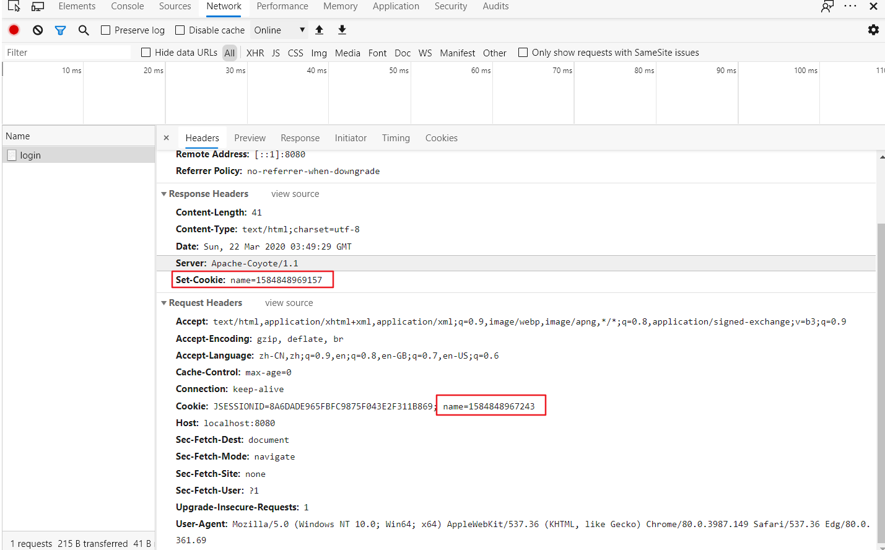
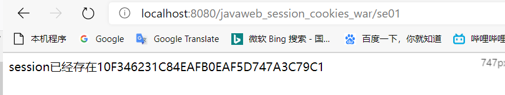
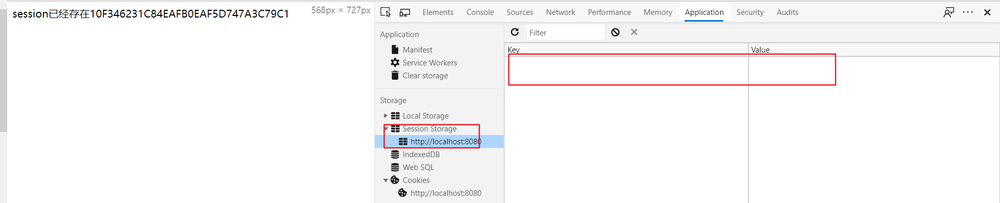
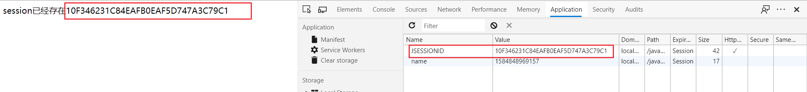
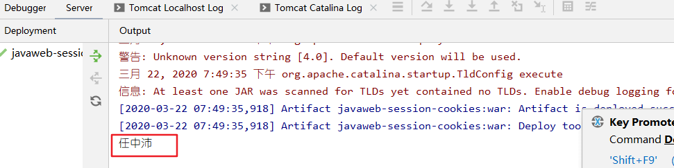

## Session&Cookies

### 1.定义

* **会话**：一个浏览器，访问了多个web资源，关闭浏览器，这个过程就是一个会话。
* **有状态会话**：同一个客户端访问服务器，下次再访问，服务器会知道，称之为有状态会话。
* **保存会话的两种技术**
  * Cookies：客户端技术（响应、请求）
  * Session：利用这个技术，可以保存用户的会话信息。

| 来源   | 服务端 | 方式    | 备注                                                     |
| ------ | ------ | ------- | -------------------------------------------------------- |
| 服务端 | 客户   | Cookies | 服务器给客户一个Cookies，客户下次访问只要带着Cookies     |
| 客户   | 服务器 | Session | 客户给服务器一个Session，客户下次访问服务器会匹配Session |

## Cookies

### 基本信息

* Cookies就是web站点给客户的“会员卡”，web站点会有个发卡记录。
* 一个web站点可以给浏览器发送多个Cookie，每个站点最多存放20个；
* 1个浏览器一般最多存放300个。
* Cookie大小为4kb。

### 主要方法

1. Cookies类，new的对象是（String，String），存放内容会比较少
2. 服务器可通过addCookie()方法，给客户端一个Cookies
3. req.getCookies()可以从客户端获取Cookies

### 示例

```java
package com.rzp.sctest;

import javax.servlet.ServletException;
import javax.servlet.http.Cookie;
import javax.servlet.http.HttpServlet;
import javax.servlet.http.HttpServletRequest;
import javax.servlet.http.HttpServletResponse;
import java.io.IOException;
import java.io.PrintWriter;
import java.sql.Date;

//保存用户上一次访问的时间
public class CookiesDemo01 extends HttpServlet {
    @Override
    protected void doGet(HttpServletRequest req, HttpServletResponse resp) throws ServletException, IOException {
        //服务器给客户端一个新建，记录来的时间，下次客户端进入就知道了

        //解决中文乱码
        req.setCharacterEncoding("utf-8");
        resp.setHeader("Content-type", "text/html;charset=UTF-8");
        resp.setCharacterEncoding("utf-8");

        PrintWriter out = resp.getWriter();

        //Cookies，服务器从客户端获取
        Cookie[] cookies = req.getCookies();//返回数组，说明Cookies存在多个
        //判断Cookies是否存在
        if(cookies!=null){
            out.write("你上一次访问的时间是:");
            for (int i = 0; i < cookies.length; i++) {
                Cookie cookie = cookies[i];
                //获取cookie的名字
                if(cookie.getName().equals("name")){
                    long lastLoginTime = Long.parseLong(cookie.getValue());
                    Date date = new Date(lastLoginTime);
                    out.write(date.toLocaleString());
                }
            }
        }else{
            out.write("第一次访问本站");
        }

        //服务器给客户端响应一个cookies,只能存string,string----存的东西较少
        Cookie newcookie = new Cookie("name", System.currentTimeMillis()+"");
        resp.addCookie(newcookie);

    }

    @Override
    protected void doPost(HttpServletRequest req, HttpServletResponse resp) throws ServletException, IOException {
        doGet(req, resp);
    }
}

```

* 上例中的Cookies随着浏览器关闭，会清除。

1. 可以在浏览器源码中查看“获取和响应”的Cookies

   

2. 可以通过        setMaxAge()方法，设置Cookies存放的时间，如下，就能设置存放时间为1天，那么即使浏览器关闭，下次打开仍然有效。同理，也可以通过源码，发现Cookies的id一样。

   ```java
           newcookie.setMaxAge(24*60*60);
   ```

3. Cookies一般会保存在本地的用户目录下。

### 删除Cookie

* 不设置有效期，关闭浏览器，自动失效；
* 创建一个名字（name）和要删除的Cookie一样的Cookies，而且设置有效期时间为0，直接失效；

### 中文参数

* 可以使用:

  ```JAVA
  //编码方法，编码后就是String
  URLEncoder.encode("任中沛"，"utf-8")
  //解码方法
  URLDecoder.decode(cookie.getValue(),"utf-8")
  ```

## Session

### 基本信息

* 服务器会给每一个用户创建一个Session对象，就像缓存。
* 1个Session独占1个会话，只要会话没有关闭，这个Session一直存在。
* Session存在时，打开同一个服务器的网址，都会有登录状态。

### 主要方法

```java
        //获取Session
        HttpSession session = req.getSession();

        //给Session中存东西
        session.setAttribute(String,Object);

        //判断Session是不是新的
        if (session.isNew()){
        
        //注销Session
        session.removeAttribute("name");
        session.invalidate();

```


### 示例1

#### Session创建的时候就创建了一个Cookies

```java
package com.rzp.sctest;

import javax.servlet.ServletException;
import javax.servlet.http.HttpServlet;
import javax.servlet.http.HttpServletRequest;
import javax.servlet.http.HttpServletResponse;
import javax.servlet.http.HttpSession;
import java.io.IOException;

public class SessionDemo01 extends HttpServlet {
    @Override
    protected void doGet(HttpServletRequest req, HttpServletResponse resp) throws ServletException, IOException {
        //解决中文乱码
        req.setCharacterEncoding("utf-8");
        resp.setHeader("Content-type", "text/html;charset=UTF-8");
        resp.setCharacterEncoding("utf-8");

        //获取Session
        HttpSession session = req.getSession();

        //给Session中存东西
        session.setAttribute("name","任中沛");
        //获取Session中的东西
        String name  = (String) session.getAttribute("name");

        //获取Session的ID
        String id = session.getId();

        //判断Session是不是新的
        if (session.isNew()){
            resp.getWriter().write("session创建成功"+id);
        }else{
            resp.getWriter().write("session已经存在"+id);
        }
    }

    @Override
    protected void doPost(HttpServletRequest req, HttpServletResponse resp) throws ServletException, IOException {
        doGet(req, resp);
    }
}

```

* 第一次登录，就是Session已经存在



* 分析网页源码
  * Session是空的

    

  * 但是Cookies有一个对应代码的记录

    

* 说明Session创建的时候就创建了一个Cookies

### 示例2

#### 在不同网页之间传递信息

```java
package com.rzp.sctest;

import javax.servlet.ServletException;
import javax.servlet.http.HttpServlet;
import javax.servlet.http.HttpServletRequest;
import javax.servlet.http.HttpServletResponse;
import javax.servlet.http.HttpSession;
import java.io.IOException;

public class SessionDemo02 extends HttpServlet {
    @Override
    protected void doGet(HttpServletRequest req, HttpServletResponse resp) throws ServletException, IOException {
        HttpSession session = req.getSession();
        String name  = (String) session.getAttribute("name");
        System.out.println(name);
    }

    @Override
    protected void doPost(HttpServletRequest req, HttpServletResponse resp) throws ServletException, IOException {
        doGet(req, resp);
    }
}

```

在上例基础上增加该类，先走示例1，存放信息，再走示例2，输出了示例1中存放的对象。



### 示例3

#### 1.手动注销Session示例

```java
package com.rzp.sctest;

import javax.servlet.ServletException;
import javax.servlet.http.HttpServlet;
import javax.servlet.http.HttpServletRequest;
import javax.servlet.http.HttpServletResponse;
import javax.servlet.http.HttpSession;
import java.io.IOException;

public class SessionDemo03 extends HttpServlet {
    @Override
    protected void doGet(HttpServletRequest req, HttpServletResponse resp) throws ServletException, IOException {
        HttpSession session = req.getSession();
        session.removeAttribute("name");
        session.invalidate();
    }

    @Override
    protected void doPost(HttpServletRequest req, HttpServletResponse resp) throws ServletException, IOException {
        doGet(req, resp);
    }
}

```

#### 2.web.xml设置Session默认失效时间

```java
    <!--设置Session 1分钟后失效-->
    <session-config>
        <session-timeout>1</session-timeout>
    </session-config>

```

## Session和Cookies的区别

* Cookie是吧用户的数据写给用户的浏览器，浏览器保存（可以保存多个）
* Session把用户数据写道用户独占Session中，服务器端保存重要信息，减少服务器负担。
* Cookies是客户记录对象，服务记录ID。
* Session是服务记录对象，客户记录ID。

## 和ServletContext的区别

* 和Session一样，都是记录服务器。
* Session是一个客户端一个。
* ServletContext是高一级别的对象，就是不同客户端都能访问到。