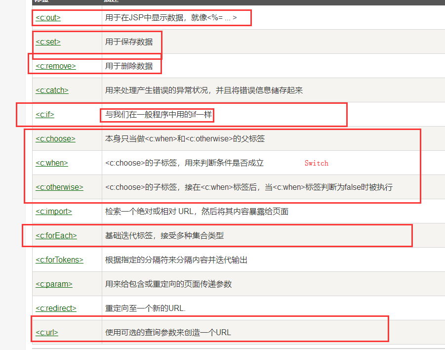

## 定义

* JSP：Java Server Pages ：Java服务器端页面，和Servlet一样，用于动态Web技术。

## 与Html区别

* Html只给用户提供静态数据
* JSP页面可以嵌入Java代码

## JSP原理

### JSP其实就是一个实现了Servlet接口的类。

* Tomcat下的work文件里就有JSP转换的类。
* IDEA下搭载了Tomcat时，可以在以下路径找到JSP转换后的类：

```java
C:\Users\RZP_H\.IntelliJIdea2019.3\system\tomcat\Unnamed_javaweb-session-cookies\work\Catalina\localhost\javaweb_session_cookies_war\org\apache\jsp
```


* 如上图，可以看到JSP其实就是一个类，分析以下源码，可以看着这个类有几个重点：
  * 继承了HttpJspBase，这个类导入包后，也可以查看源码，能发现其实就是Servlet的子类
  * 创建了session,pageContext,application等对象，这就是我们能够通过req.getSession获得这些对象的原因，也是在JSP中能直接使用这些对象的原因。
  * //setContentType("text/html")----jsp能够变成HTML的原因
  *  out.write("<html>\n")----jsp实际上也是使用实现Writer的类来实现页面显示!
  * 因此当我们用<%%>在JSP写Java代码的时候，实际上就是把Java代码嵌到了JSP这个类里面！

```java
/*
 * Generated by the Jasper component of Apache Tomcat
 * Version: Apache Tomcat/7.0.82
 * Generated at: 2020-03-22 11:54:56 UTC
 * Note: The last modified time of this file was set to
 *       the last modified time of the source file after
 *       generation to assist with modification tracking.
 */
package org.apache.jsp;

import javax.servlet.*;
import javax.servlet.http.*;
import javax.servlet.jsp.*;

//继承了HttpJspBase，这个类导入包后，也可以查看源码，能发现其实就是Servlet的子类
public final class index_jsp extends org.apache.jasper.runtime.HttpJspBase
    implements org.apache.jasper.runtime.JspSourceDependent {

  private static final javax.servlet.jsp.JspFactory _jspxFactory =
          javax.servlet.jsp.JspFactory.getDefaultFactory();

  private static java.util.Map<java.lang.String,java.lang.Long> _jspx_dependants;

  private volatile javax.el.ExpressionFactory _el_expressionfactory;
  private volatile org.apache.tomcat.InstanceManager _jsp_instancemanager;

  public java.util.Map<java.lang.String,java.lang.Long> getDependants() {
    return _jspx_dependants;
  }

  public javax.el.ExpressionFactory _jsp_getExpressionFactory() {
    if (_el_expressionfactory == null) {
      synchronized (this) {
        if (_el_expressionfactory == null) {
          _el_expressionfactory = _jspxFactory.getJspApplicationContext(getServletConfig().getServletContext()).getExpressionFactory();
        }
      }
    }
    return _el_expressionfactory;
  }

  public org.apache.tomcat.InstanceManager _jsp_getInstanceManager() {
    if (_jsp_instancemanager == null) {
      synchronized (this) {
        if (_jsp_instancemanager == null) {
          _jsp_instancemanager = org.apache.jasper.runtime.InstanceManagerFactory.getInstanceManager(getServletConfig());
        }
      }
    }
    return _jsp_instancemanager;
  }

  public void _jspInit() {
  }

  public void _jspDestroy() {
  }

  public void _jspService(final javax.servlet.http.HttpServletRequest request, final javax.servlet.http.HttpServletResponse response)
        throws java.io.IOException, javax.servlet.ServletException {
      
      //创建了session,pageContext,application等对象，这就是我们能够通过req.getSession获得这些对象的原因
    final javax.servlet.jsp.PageContext pageContext;  //页面上下文
    javax.servlet.http.HttpSession session = null;   //session
    final javax.servlet.ServletContext application;  //applicationContext
    final javax.servlet.ServletConfig config;        //config
    javax.servlet.jsp.JspWriter out = null;          //out
    final java.lang.Object page = this;              //page：当前
    javax.servlet.jsp.JspWriter _jspx_out = null;
    javax.servlet.jsp.PageContext _jspx_page_context = null;


    try {
        //setContentType("text/html");jsp能够变成HTML的原因
      response.setContentType("text/html");
      pageContext = _jspxFactory.getPageContext(this, request, response,
      			null, true, 8192, true);
      _jspx_page_context = pageContext;
      application = pageContext.getServletContext();
      config = pageContext.getServletConfig();
      session = pageContext.getSession();
      out = pageContext.getOut();
      _jspx_out = out;
        
        
        // out.write("<html>\n")----jsp实际上也是使用实现Writer的类来实现页面显示!
      out.write("<html>\n");
      out.write("<body>\n");
      out.write("<h2>Hello World!</h2>\n");
      out.write("</body>\n");
      out.write("</html>\n");
    } catch (java.lang.Throwable t) {
      if (!(t instanceof javax.servlet.jsp.SkipPageException)){
        out = _jspx_out;
        if (out != null && out.getBufferSize() != 0)
          try {
            if (response.isCommitted()) {
              out.flush();
            } else {
              out.clearBuffer();
            }
          } catch (java.io.IOException e) {}
        if (_jspx_page_context != null) _jspx_page_context.handlePageException(t);
        else throw new ServletException(t);
      }
    } finally {
      _jspxFactory.releasePageContext(_jspx_page_context);
    }
  }
}

```

* JSP实现流程


## 基本依赖

```java
    <dependency>
      <groupId>junit</groupId>
      <artifactId>junit</artifactId>
      <version>4.11</version>
      <scope>test</scope>
    </dependency>
    <!--servlet依赖-->
    <dependency>
      <groupId>javax.servlet</groupId>
      <artifactId>servlet-api</artifactId>
      <version>2.5</version>
    </dependency>
    <!--jsp依赖-->
    <dependency>
      <groupId>javax.servlet.jsp</groupId>
      <artifactId>jsp-api</artifactId>
      <version>2.1</version>
    </dependency>
    <!--jstl表达式-->
    <dependency>
      <groupId>javax.servlet.jsp.jstl</groupId>
      <artifactId>jstl-api</artifactId>
      <version>1.2</version>
    </dependency>
    <!--standard标签库-->
    <dependency>
      <groupId>taglibs</groupId>
      <artifactId>standard</artifactId>
      <version>1.1.2</version>
    </dependency>

```

## JSP基本语法

### JSP声明四种方式

```java
<%.....%>   会被编译到JSP类的_jspService方法中
<%!.....%>   会被直接编译到JSP类的中（而不是_jspService方法中），可以声明该类的全局变量。。
<%=....%>   会被编译成out.print(....)
<%----%>    注释，该注释和HTML的<!---->不同，不会被生成到客户端中
```

### 常用方式

#### JSP表达式

```java

  <%--JSP表达式
  作用：用来将程序的输出，输出到客户端
  <%= 变量或者表达式%>
  --%>
  <%= new java.util.Date()%>

```

#### JSP脚本片段

```java
  <hr>
  <%--JSP脚本片段--%>
  <%
    int sum = 0;
    for (int i = 0; i < 100; i++) {
      sum+=i;
    }
    out.println("<h1>Sum="+sum+"</h1>");
  %>
```

#### 脚本片段的再实现

* x只需要定义一次，其实就是JSP原理中说明的，就是嵌入到一个了这个JSP的类里面，所以只要定义一次

```java
  <%
    int x= 10;
    out.println(x);
  %>
  <p>这是一个JSP文档</p>
  <%
    out.println(x);
  %>

  <hr>
```

* 同理，还可以在Java语言中嵌入HTML

```java
  <%
    for (int i = 0; i < 5; i++) {
  %>
  <h1>Hello World <%=i%></h1>
  <%
    }
  %>
```

## JSP指令

### 基本指令

```java
　　JSP指令的格式：<%@指令名 attr1=”” attr2=”” %>，一般都会把JSP指令放到JSP文件的最上方，但这不是必须的。 
　　JSP中的指令共有三个:page、taglib、include。最常用的是page指令和taglib。


```

### page

1. page指令 
   page指令是最为常用的指定，也是属性最多的属性！ 
   page指令没有必须属性，都是可选属性。例如<%@page %>，没有给出任何属性也是可以的！ 
   在JSP页面中，任何指令都可以重复出现！ 
   <%@ page language=”java”%> 
   <%@ page import=”java.util.*”%> 
   <%@ page pageEncoding=”utf-8”%> 
   这也是可以的！
2. page指令的pageEncoding和contentType（重点） 
   pageEncoding指定当前JSP页面的编码！这个编码是给服务器看的，服务器需要知道当前JSP使用的编码，不然服务器无法正确把JSP编译成java文件。所以这个编码只需要与真实的页面编码一致即可！在MyEclipse中，在JSP文件上点击右键，选择属性就可以看到当前JSP页面的编码了。 
   contentType属性与response.setContentType()方法的作用相同！它会完成两项工作，一是设置响应字符流的编码，二是设置content-type响应头。例如：<%@ page contentType=”text/html;charset=utf-8”%>，它会使“真身”中出现response.setContentType(“text/html;charset=utf-8”)。 
   无论是page指令的pageEncoding还是contentType，它们的默认值都是ISO-8859-1，我们知道ISO-8859-1是无法显示中文的，所以JSP页面中存在中文的话，一定要设置这两个属性。 
   其实pageEncoding和contentType这两个属性的关系很“暧昧”： 
   1.当设置了pageEncoding，而没设置contentType时： contentType的默认值为pageEncoding； 
   2.当设置了contentType，而没设置pageEncoding时： pageEncoding的默认值与contentType； 
   也就是说，当pageEncoding和contentType只出现一个时，那么另一个的值与出现的值相同。如果两个都不出现，那么两个属性的值都是ISO-8859-1。所以通过我们至少设置它们两个其中一个！
3. page指令的import属性 
   import是page指令中一个很特别的属性！ 
   import属性值对应“真身”中的import语句。 
   import属性值可以使逗号：<%@page import=”java.net.* ,java.util.* ,java.sql.*”%> 
   import属性是可以重复出现的： 
   <%@page import=”java.util.* ” import=”java.net.* ” import=”java.sql.*”%> 
   然而，pageEncoding这个属性不能够重复出现，不管是在一条page指令中还是在多条page指令中，只要其中一条page指令出现过了，另外一条page指令就不能够再出现pageEncoding，不管属性值是否相同。(我现在只检查了pageEncoding不能够重复出现，其它的page属性我没有检查，不检查的原因是个人感觉没有必要，因为你是不会犯这种低级错误的。常常我们设置了的就不会去重复设置了，除了import导包外。) 
   然而，我们一般会使用多个page指令来导入多个包: 
   <%@ page import=”java.util.*”%> 
   <%@ page import=”java.net.*”%> 
   <%@ page import=”java.text.*”%>
4. page指令的errorPage和isErrorPage 
   我们知道，在一个JSP页面出错后，Tomcat会响应给用户错误信息（500页面）！如果你不希望Tomcat给用户输出错误信息，那么可以使用page指令的errorPage来指定错误页！也就是自定义错误页面，例如：<%@page errorPage=”xxx.jsp”%>。这时，在当前JSP页面出现错误时，会请求转发到xxx.jsp页面。浏览器地址栏是不会变化的。并且转发是留消息头而不留消息体即当前页面输出的内容是不会在错误页面出现的。

### include

include指令表示静态包含！即目的是把多个JSP合并成一个JSP文件！ 
include指令只有一个属性：file，指定要包含的页面，例如：<%@include file=”b.jsp”%>。

静态包含：当hel.jsp页面包含了lo.jsp页面后，在编译hel.jsp页面时，需要把hel.jsp和lo.jsp页面合并成一个文件，然后再编译成Servlet（Java文件）。


### taglib指令

这个指令需要在学习了自定义标签后才会使用，现在只能做了了解而已！ 
在JSP页面中使用第三方的标签库时，需要使用taglib指令来“导包”。例如： 
<%@ taglib prefix=”c” uri=”http://java.sun.com/jsp/jstl/core” %> 
其中prefix表示标签的前缀，这个名称可以随便起。uri是由第三方标签库定义的，所以你需要知道第三方定义的uri。当然uri也可以是绝对路径！

### 常用指令

#### 定义错误页面

* 在页面上方增加代码，就可以指向错误页面

```java
<%--定制错误页面--%>
<%@ page errorPage="error/500.jsp" %>

```


* 也可以在web.xml中全局配置

```java
    <error-page>
        <error-code>404</error-code>
        <location>/error/404.jsp</location>
    </error-page>
    <error-page>
        <error-code>500</error-code>
        <location>/error/500.jsp</location>
    </error-page>


```

## 作用域

```java
pageContext.setAttribute("name1","秦疆1号"); //保存的数据只在一个页面中有效
request.setAttribute("name2","秦疆2号"); //保存的数据只在一次请求中有效，请求转发会携带这个数据
session.setAttribute("name3","秦疆3号"); //保存的数据只在一次会话中有效，从打开浏览器到关闭浏览器
application.setAttribute("name4","秦疆4号");  //保存的数据只在服务器中有效，从打开服务器到关闭服务器
application就相当于ServletContext
```

* 取出来的时候，低层可以取高层的，比如pageContext.findAttribute方法可以取出上述四个存放的对象。
* 和JVM的双亲委派机制一样，从低层找到高层

## EL表达式

```xml
<!-- JSTL表达式的依赖 -->
<dependency>
    <groupId>javax.servlet.jsp.jstl</groupId>
    <artifactId>jstl-api</artifactId>
    <version>1.2</version>
</dependency>
<!-- standard标签库 -->
<dependency>
    <groupId>taglibs</groupId>
    <artifactId>standard</artifactId>
    <version>1.1.2</version>
</dependency>

```

EL表达式：  ${ }

- **获取数据**
- **执行运算**
- **获取web开发的常用对象**

## **JSTL表达式**

JSTL标签库的使用就是为了弥补HTML标签的不足；它自定义许多标签，可以供我们使用，标签的功能和Java代码一样！

**格式化标签**

**SQL标签**

**XML 标签**

**核心标签** （掌握部分）



**JSTL标签库使用步骤**

- 引入对应的 taglib
- 使用其中的方法
- **在Tomcat 也需要引入 jstl的包，否则会报错：JSTL解析错误**

c：if

```jsp
<head>
    <title>Title</title>
</head>
<body>


<h4>if测试</h4>

<hr>

<form action="coreif.jsp" method="get">
    <%--
    EL表达式获取表单中的数据
    ${param.参数名}
    --%>
    <input type="text" name="username" value="${param.username}">
    <input type="submit" value="登录">
</form>

<%--判断如果提交的用户名是管理员，则登录成功--%>
<c:if test="${param.username=='admin'}" var="isAdmin">
    <c:out value="管理员欢迎您！"/>
</c:if>

<%--自闭合标签--%>
<c:out value="${isAdmin}"/>

</body>
```

c:choose   c:when

```jsp
<body>

<%--定义一个变量score，值为85--%>
<c:set var="score" value="55"/>

<c:choose>
    <c:when test="${score>=90}">
        你的成绩为优秀
    </c:when>
    <c:when test="${score>=80}">
        你的成绩为一般
    </c:when>
    <c:when test="${score>=70}">
        你的成绩为良好
    </c:when>
    <c:when test="${score<=60}">
        你的成绩为不及格
    </c:when>
</c:choose>

</body>
```

c:forEach

```jsp
<%

    ArrayList<String> people = new ArrayList<>();
    people.add(0,"张三");
    people.add(1,"李四");
    people.add(2,"王五");
    people.add(3,"赵六");
    people.add(4,"田六");
    request.setAttribute("list",people);
%>


<%--
var , 每一次遍历出来的变量
items, 要遍历的对象
begin,   哪里开始
end,     到哪里
step,   步长
--%>
<c:forEach var="people" items="${list}">
    <c:out value="${people}"/> <br>
</c:forEach>

<hr>

<c:forEach var="people" items="${list}" begin="1" end="3" step="1" >
    <c:out value="${people}"/> <br>
</c:forEach>

```

## JavaBean

### 定义

就是符合以下三种写法的实体类。

- 必须要有一个无参构造
- 属性必须私有化
- 必须有对应的get/set方法；

一般用来和数据库的字段做映射  ORM；

### ORM ：对象关系映射

- 表--->类
- 字段-->属性
- 行记录---->对象

**people表**

| id   | name    | age  | address |
| ---- | ------- | ---- | ------- |
| 1    | 秦疆1号 | 3    | 西安    |
| 2    | 秦疆2号 | 18   | 西安    |
| 3    | 秦疆3号 | 100  | 西安    |

```java
class People{
    private int id;
    private String name;
    private int id;
    private String address;
}

class A{
    new People(1,"秦疆1号",3，"西安");
    new People(2,"秦疆2号",3，"西安");
    new People(3,"秦疆3号",3，"西安");
}
```

