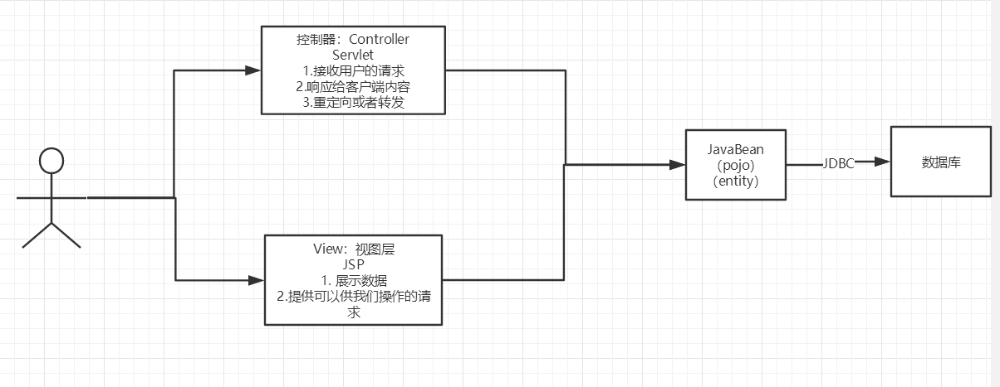
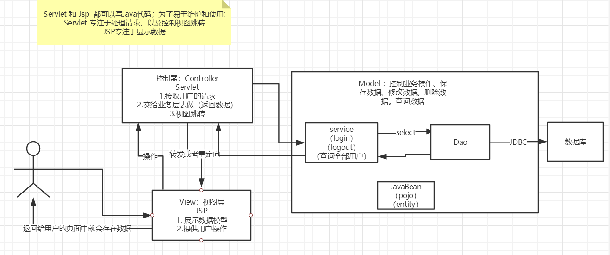

## MVC三层架构

什么是MVC：

| Model                | view     | Controller           |
| -------------------- | -------- | -------------------- |
| 模型                 | 视图     | 控制器               |
| 业务逻辑，数据库操作 | 展示数据 | 接收、转发、跳转页面 |
| pojo                 | 用户操作 | M和V层的中间         |


### 10.1、早些年



用户直接访问控制层，控制层就可以直接操作数据库；

```java
servlet--CRUD-->数据库
弊端：程序十分臃肿，不利于维护  
servlet的代码中：处理请求、响应、视图跳转、处理JDBC、处理业务代码、处理逻辑代码

架构：没有什么是加一层解决不了的！
程序猿调用
|
JDBC
|
Mysql Oracle SqlServer ....
```

### 10.2、MVC三层架构




Model

- 业务处理 ：业务逻辑（Service）
- 数据持久层：CRUD   （Dao）

View

- 展示数据
- 提供链接发起Servlet请求 （a，form，img…）

Controller  （Servlet）

- 接收用户的请求 ：（req：请求参数、Session信息….）

- 交给业务层处理对应的代码 

- 控制视图的跳转  

  ```java
  登录--->接收用户的登录请求--->处理用户的请求（获取用户登录的参数，username，password）---->交给业务层处理登录业务（判断用户名密码是否正确：事务）--->Dao层查询用户名和密码是否正确-->数据库
  ```

